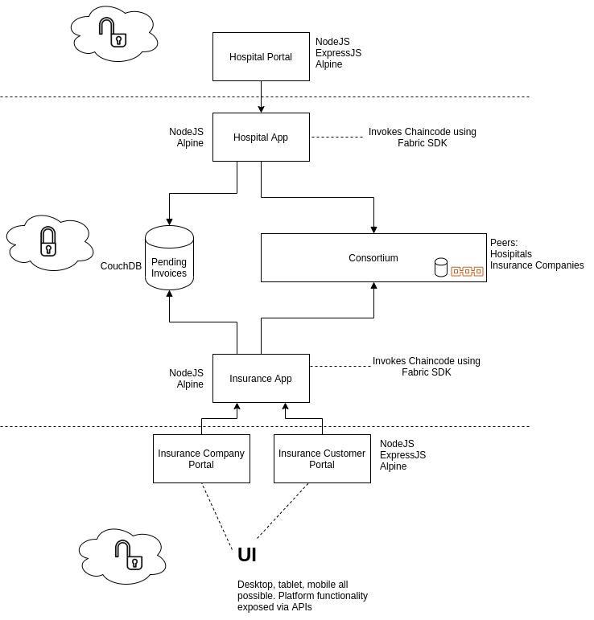

# TraceInsure

Digitizing health insurance claim journeys in a safe and secure manner

## Solution

A consortium of trusted parties will join a network built with Hyperledger Fabric. Consortium peers are hospitals and insurance companies.

## Assumptions

1. Hospitals and insurance companies trust each other's identities by virtue of being onboarded onto the network 'HealthNet'
1. Insurance companies are responsible for authenticating their customer's identities (Know Your Customer)

## Flow

1. Hospital employee logs into hospital portal and creates an invoice stating customers identity
1. Invoice goes to 'pending' state
1. Customer logs into customer portal and accepts the invoice with authentication, e.g., a transaction sealing PIN, or other credential
1. Invoice gets committed to the blockchain
1. Insurance company employee logs into insurance company portal and reviews submission
1. Insurance company approves or rejects submission, either decision gets committed to blockchain

## Architecture

